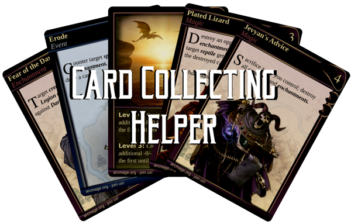

<div align="center">

# 

</div>

# CardCollectingFrontPublic

> Frontend part of my engineering thesis

## Main goal
This app focuses on helping fans of a collectible card game to keep a track of their collection and also extend it by implementing a small market system with the addition of messages between users.

## Brief list of features

- User accounts
- Users can keep track of their collection, wishlist and market orders
- Public user profiles
- A place to browse through all existing cards with the option of adding them to personal collection or wishlist
- Admin accounts can manage existing cards and their images
- All cards have their own site with all their information, user comments and a direct link to their market site
- Market site of a card lists all current buy and sell orders by users, the list can be sorted by quantity or price per unit
- The said market site also shows a summary of past months statistics on market with additional graphs
- Messages between users and a personal notes section in the form of messages from user to themselves

## Installation and requirements

This app needs [backend]() part of the project in order to work propperly.

Install the required node modules
```bash
npm install
```

Run angular project (default port is 4200)
```bash
ng serve
```

## Core used framework, libraries and modules

- Angular 19
- Tailwind
- Taiga-ui

## Disclaimer

The cards, their images and information are based on the cards from an open source card game [Arcmage](https://www.arcmage.org)

The *logo* of the project is also created with the use of their cards.

The background image is from free Unsplash library, original author: Sebastian Unrau

## Screenshots


